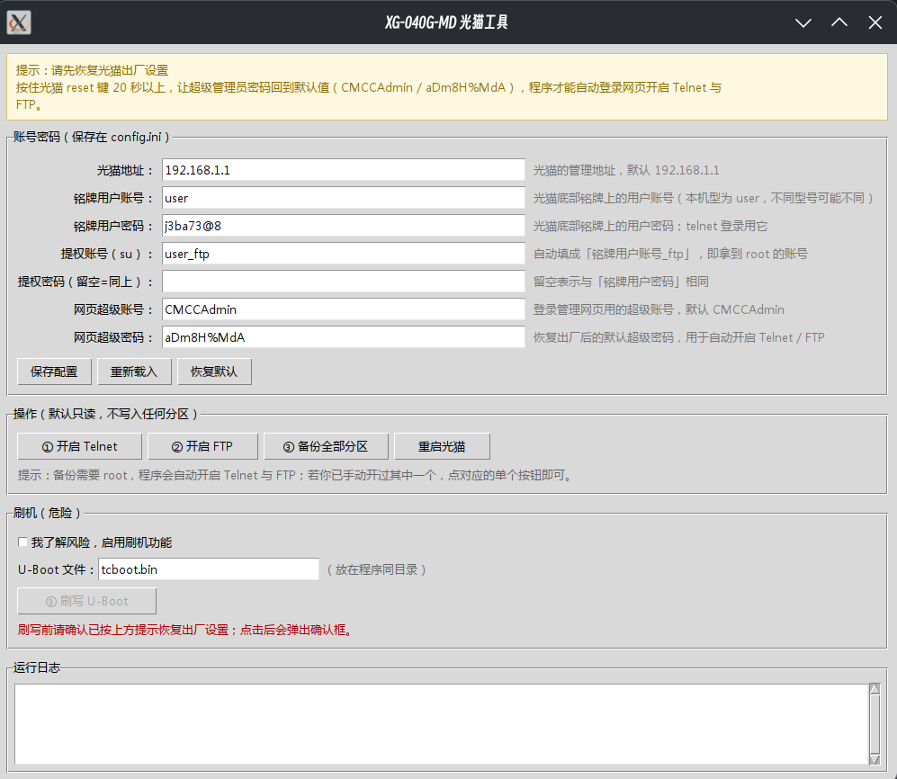

# 贝尔XG-040G-MD 一键刷入使用教程

## 图形界面（推荐新手用）

不想敲命令的话，直接运行 `gui.py`（Windows 上跑打包好的 `XG-040G-MD工具.exe`）：

```bash
python3 gui.py
```

界面长这样：



界面分四块：

1. **顶部提示**——常驻的黄色提示，说明使用前要恢复出厂设置（见下文）。
2. **账号密码**——光猫地址、铭牌用户账号/密码、提权账号、网页超级账号密码，
   全部存在同目录的 `config.ini` 里。改完点「保存配置」；「恢复默认」会填回
   移动版出厂默认值（`CMCCAdmin` / `aDm8H%MdA`）。

   两个字段有联动：**提权账号会自动填成「铭牌用户账号_ftp」**——改铭牌账号，
   提权账号跟着变（例如 `user` → `user_ftp`）；如果你手工改过提权账号，
   程序就不再自动覆盖它。
3. **操作**——`① 开启 Telnet`、`② 开启 FTP`、`③ 备份全部分区`、`重启光猫`。
   这些都是只读的，不写入设备任何分区。
4. **刷机**——默认**锁定**。必须先勾选「我了解风险，启用刷机功能」，
   刷写按钮才会解锁。点刷写后会弹一个确认框，列出待写入的文件、大小和
   目标分区，确认后才动手。
5. **运行日志**——和命令行输出完全一样的内容（GUI 直接接管了 `print`）。

`config.ini` 长这样（可以手工编辑，也可以只用界面）：

```ini
# 设备与网络
[device]
router_ip = 192.168.1.1
auto_enable_telnet = true
auto_enable_ftp = true
skip_backup_if_complete = true

# telnet 登录与提权账号
[telnet]
username = user
password = j3ba73@8
su_user = user_ftp
root_password =

# 网页超级管理员账号（用于自动开启 Telnet / FTP）
[super]
username = CMCCAdmin
password = aDm8H%MdA

# 安全开关
[safety]
allow_flash = false
```

`root_password` 留空表示**与 telnet 密码相同**（本机型实测就是同一个密码）。

### Windows 免安装版

`dist/XG-040G-MD工具.exe` 是打包好的单文件程序（约 13MB），**不需要装 Python**：

1. 把 `XG-040G-MD工具.exe` 和 `tcboot.bin` 放在**同一个目录**；
2. 双击运行；
3. 界面里填好账号密码，点「保存配置」，会在同目录生成 `config.ini`。

注意：
- exe 是 64 位 Windows 程序（Win7 及以上）；
- `tcboot.bin` **已内置在 exe 里**，开箱即用；想换别的版本，把文件放到
  exe 同目录即可（同目录优先于内置副本）；
- 首次运行若被 SmartScreen 拦截，选「更多信息 → 仍要运行」即可（程序未做代码签名）。

### exe 自检（排查缺依赖）

打包成 exe 后 `flash.py` 是运行时动态加载的，万一漏了某个模块，
可以跑自检确认：

```bat
XG-040G-MD工具.exe --selftest
```

它会把依赖逐个导入一遍、加载一次 `flash.py`，结果同时写到程序目录的
`selftest.log`。全部正常退出码为 0；有问题会弹窗并列出缺什么。

### 关于「恢复出厂设置」提示

界面顶部有一条固定的黄色提示，说明**必须先恢复出厂设置**：按住 reset 键
20 秒以上，让超级管理员密码回到默认的 `CMCCAdmin` / `aDm8H%MdA`，
程序才能自动登录网页去开启 Telnet 和 FTP。

这条提示是常驻的使用前提说明，**不跟刷机按钮绑定**——开 Telnet、备份同样
需要超级密码是默认值。

## 系统要求
- **Windows**：直接跑 `dist/XG-040G-MD工具.exe`，无需安装任何东西（见上文
  「Windows 免安装版」）。
- **Linux / WSL / MSYS2**：用 `python3 flash.py`（命令行）或 `python3 gui.py`
  （图形界面）。图形界面需要系统带 tkinter，多数发行版装 `python3-tk` 即可。

## 前置依赖安装

### Python 包
```bash
pip install telnetlib3
```

### 系统软件包
**不再需要 netcat**。备份/上传改用临时 HTTP 服务器 + 设备侧 `curl`（见下文
「为什么用 HTTP 而不是 nc」），只依赖 Python 标准库。

## 准备工作

1. **重置路由器**
   - 按住 reset 键 20 秒以上，将设备恢复至出厂设置

2. ~~**登录系统**~~ —— **已自动化，脚本会自动完成**
   - 脚本用超级管理员账号 `CMCCAdmin` / `aDm8H%MdA` 自动登录网页，
     调用 `POST /system.cgi?telnet+on` 开启 Telnet（免拆机），不需要手工点。

3. **开启 FTP 文件共享** —— **已自动化，脚本会自动完成**
   - 脚本登录网页后会自动打开 FTP 服务（`POST /storage.cgi?ftp_config`，
     带会话 `csrf_token`），实测 1 秒内 21 端口即 LISTEN。
   - 这一步不是为了传文件，而是因为 **`su user_ftp` 这个提权账号只在
     FTP 服务启用后才会被创建**（它由 `IGD FTP Server` 动态注入
     `/etc/passwd`）。没开 FTP 时 `su user_ftp` 会报
     `su: unknown user user_ftp`。
   - 检测到 21 端口已开则跳过网页步骤（`AUTO_ENABLE_FTP`）。
   - 脚本**不会**在结束时自动关掉 FTP：关掉会让 `user_ftp` 消失，下次
     运行还得再开一遍，而且万一把设备留在半途更麻烦。介意 21 端口长期
     暴露的话，备份完手工关掉即可。

4. **自动跳过重复备份** —— **已自动化**
   - 每次备份会在目录里写入 `device.json`（设备信息 + 17 个分区的
     SHA256）。再次运行时若发现**同一序列号**且**校验完整**的备份，
     直接跳过备份，省下 545MB 的传输（见下文「备份清单与跳过逻辑」）。

## 运行模式

脚本默认 **只备份、不刷机**（安全优先）。用 `--mode` 切换：

| 模式 | 作用 | 是否写入设备 |
|---|---|---|
| `--mode telnet` | 仅自动开启 Telnet（不碰 FTP） | 否 |
| `--mode ftp` | 仅自动开启 FTP（不碰 Telnet） | 否 |
| `--mode backup`（默认） | 开启 Telnet+FTP + 备份 mtd0–mtd16 | 否 |
| `--mode flash` | 开启 Telnet+FTP + 备份 + 刷写 U-Boot | **是，危险** |

图形界面里对应四个按钮：`① 开启 Telnet`、`② 开启 FTP`、
`③ 备份全部分区`、`重启光猫`，外加默认锁定的「刷写 U-Boot」。

**Telnet 和 FTP 是两个独立开关**，各自单独检测端口：
- 两个都关 → `--mode backup` 会依次自动开启；
- 只开了 Telnet（比如你自己开过）→ 点「② 开启 FTP」单独补上即可；
- 只开了 FTP → 点「① 开启 Telnet」；
- 已经开着的那个会打印「检测到 … 已开启，跳过网页开启步骤」，不会重复操作。

```bash
python3 flash.py --mode telnet     # 最安全，只开 telnet
python3 flash.py --mode backup     # 只备份全部分区
python3 flash.py --mode flash      # 刷机（会要求输入 YES 二次确认）
python3 flash.py --reboot          # 只重启光猫（清掉网页会话 / telnet 锁定）
```

其他选项：
- `--no-enable-telnet`：假定 Telnet 已手动开启，跳过网页步骤
- `--no-enable-ftp`：假定 FTP 已手动开启，跳过网页步骤
- `--force-backup`：即使已存在同一台设备的完整备份，也强制重新备份
- `-y / --yes`：`flash` 模式下跳过 YES 二次确认
- `-h / --help`：显示用法

## 配置和刷入

1. **修改脚本配置**
   - 根据你的光猫型号，修改 `flash.py` 脚本中的相关配置
   - 重要项：`PASSWORD`（telnet 密码，通常印在光猫**底部铭牌**上）、
     `SU_USER`（提权账号，本机型为 `user_ftp`）、`MODE`（默认运行模式）
   - 本机型实测：`PASSWORD = "j3ba73@8"`，`SU_USER = "user_ftp"`，
     且 `su user_ftp` 的密码**就是** telnet 密码（`ROOT_PASSWORD = PASSWORD`）

2. **获取 uboot 文件**
   - `tcboot.bin` 来自 **NWRT**——是 nwrt 专门为这款光猫开发的 tcboot
   - 网站地址：https://nwrt.kuroneko.host/
   - 刷完 tcboot 重启后，可以进 tcboot 换成更现代化的新 U-Boot：
     - 推荐 **loong1996 的 web U-Boot**：
       https://github.com/Loong1996/ImmortalWrt-Airoha
     - **ponwrt** 也兼容，可直接刷
   - 刷 QWRT 有两条路线，别搞混：
     - **tcboot 直接刷 QWRT**：一步到位，不需要拆分；
     - **刷到 webuboot / uboot-an758x 再上 QWRT**：需要把 QWRT
       **拆分成两个包分别刷入**，见
       https://github.com/xe5700/qwrt_for_uboot-an758x
       （uboot-an758x 本体：https://github.com/pbs05/uboot-an758x）

3. **运行刷入脚本**
   ```bash
   python flash.py --mode flash
   ```

## 刷写后的回读校验（重要）

写完 U-Boot **不能马上回读判定**——这一条是实测踩出来的。

原因：`dd of=/dev/mtdblock0` 写的是**块设备**，数据先落到 block 层的页缓存；
`dd` 返回时 mtdblock 只是收到了请求，真正「擦除 + 写入 flash 芯片」由内核的
`mtd_blktrans` 线程异步完成，**可能还在队列里**。而校验读的 `/dev/mtd0` 是
**字符设备**，直读芯片、不经过块层缓存。所以刚写完就读，读回来的还是旧数据，
过几秒到几十秒才变成新数据。

因此 `flash_uboot()` 的校验是**轮询等待**，不是读一次：

1. `dd` 写入后先检查返回码（`echo DD_RC=$?`），非 0 直接报错退出；
2. 循环执行 `sync` → `dd if=/dev/mtd0` → `sha512sum`，每次间隔
   `FLASH_VERIFY_INTERVAL` 秒；
3. 哈希与期望一致即判定成功并打印是第几次回读命中的；
4. 超过 `FLASH_VERIFY_TIMEOUT` 秒仍不一致才判失败（这时才提示"请手动还原，
   以免变砖"）。

两个参数默认 **120 秒 / 5 秒**，够 512KB 的 U-Boot 生效（实测几秒到几十秒）。
可以在 `config.ini` 的 `[safety]` 段调整：

```ini
[safety]
allow_flash = false
flash_verify_timeout = 120     # 最长轮询秒数
flash_verify_interval = 5      # 每次回读间隔秒数
```

校验用 `/dev/mtdN`（字符设备，直读芯片）而**不是** `/dev/mtdblockN`
（块设备会命中 mtdblock 自己的缓存，可能读到还没写下去的旧数据）——
这个区别正是上面那个坑的根源。

## 为什么用 HTTP 而不是 nc

早期版本用 `dd | nc` 传分区，主机侧必须**精确卡时间**先起 `nc -l` 监听，
设备才敢连。任一环节慢一拍就丢数据（实测表现为备份文件 0 字节），
而且 17 个分区就是 17 次独立竞态。

现在改成：主机用标准库起一个临时 HTTP 服务器，设备侧用自带的 `curl` 上传：

```
dd if=/dev/mtdN bs=1M | curl -s -T - http://<主机IP>:8080/mtdN_name.bin
```

HTTP 是请求-响应模型，没有竞态；每个分区独立一次 PUT，失败可单独重试；
传输完还会用 `MTD_SIZES` 表逐分区校验字节数，不符立即中止。

本机型实测 `/sbin/curl` 为 **curl 7.77.0**（OpenSSL 1.1.1d，支持
http/https/ftp/tftp）。脚本启动前会探测 curl 是否存在。

两种方式产出的镜像已做字节级比对：**15/17 分区 SHA256 完全一致**，
仅 `log`（内核持续写日志）和包含它的 `all_flash` 不同，属预期行为。

## 备份清单与跳过逻辑

每次备份完成后，脚本会在备份目录里写一份 `device.json`：

```json
{
  "device": {
    "SerialNumber": "NBELFCFD60A5",
    "Hostname": "HLSC-XG140GMD-NBELFCFD60A5",
    "ModelName": "XG-140G-MD",
    "Manufacturer": "NBEL",
    "HardwareVersion": "XG140GMDV10",
    "SoftwareVersion": "NXGS1426V07t01",
    "ProductClass": "XG-140G-MD",
    "MacAddress": "04:56:65:40:a8:27"
  },
  "files": { "mtd0_bootloader.bin": { "size": 524288, "sha256": "60e4…" }, … }
}
```

再次运行时，脚本会按目录名倒序扫描 `backup_*`，找到**第一个**满足
下列全部条件的目录就跳过备份：

1. `device.json` 存在，且 `SerialNumber` 与当前设备**完全一致**
   （任一为空都判为不通过，保守处理）；
2. 17 个分区文件齐全，字节数与清单、`MTD_SIZES` 表三方吻合；
3. 每个文件的 SHA256 与清单记录一致。

任一条不满足就重新备份。想强制重来用 `--force-backup`。

- 机型/序列号来自设备本身：`cfgcli -g InternetGatewayDevice.DeviceInfo.*`
  取型号与厂商；**序列号取 `hostname` 的最后一段**，因为 `cfgcli -g` 的
  `SerialNumber` 被固件脱敏成 `******`。
- `MacAddress` 取 `cat /sys/class/net/br0/address`。

## 常见问题

### 提示"用户 CMCCAdmin 已经登录，请稍后重试"
光猫**同一时间只允许一个网页会话**。如果浏览器里还开着管理页面，脚本就登录不上去。
处理办法（二选一）：
- 关掉浏览器里的管理页面，等它自动超时释放；
- 直接重启光猫清掉会话：`python3 flash.py --reboot`

### 重启光猫（`--reboot` / 界面「重启光猫」）
调用管理页的 `POST /system.cgi?reboot`，等于网页上的「设备重启」按钮。
实测设备会下线约 20 秒后恢复，`uptime` 归零确认真的重启了。

⚠️ 端点必须是 `/system.cgi?reboot`。**不要**用 `/devicemanagement.cgi`——
那个页面是「恢复配置」，它只认 `?restore` 和 `?restore_factory`，
后者是**恢复出厂设置**，会清掉超级密码和全部配置。

### 提示 telnet 认证失败 / 300 秒锁定
光猫**连续 3 次认证失败会锁定 telnet 约 300 秒**。锁定期间请不要重试，
重启可立刻解除：
```bash
python3 flash.py --reboot
```
另外请确认配置区的 `PASSWORD` 是**光猫底部铭牌上的 telnet 密码**，
它和网页超级密码 `aDm8H%MdA` 不是同一个。

### 提示"获取 root 权限失败"
备份和刷写都需要 root 权限，非 root 下 busybox 会直接拒绝执行 dd：

```
dd: you have no permission to run this applet!
```

（`/dev/mtd*` 是 `crw-rw---- root root`）。

**本机型已打通的提权路径**（实测验证）：

```
telnet 登录 user / j3ba73@8     → $ 提示符，uid=1001(user-telnet)
su user_ftp                     → Password: 输入 j3ba73@8
                                → # 提示符，uid=0(root)  ← 直接就是 root
```

要点：
- **`su user_ftp` 的密码就是 telnet 密码**，不需要另外找第三方凭据。
- **前提是网页上已启用 FTP 服务**。`user_ftp` 账号在启用 FTP 之前
  **不存在**于 `/etc/passwd`（那时只有 `root` / `user-common` /
  `osgi_admin` / `user-telnet`），所以会报 `su: unknown user user_ftp`。
- 拿到 root 后 `dd if=/dev/mtd8 of=/dev/null` 返回 `rc=0`，备份才能进行。

历史上探测失败、现已排除的 su 目标（留档以免重走弯路）：

| su 目标账号 | 结果 |
|---|---|
| `useradmin_ftp` | 该账号在这版固件里不存在 → `su: unknown user` |
| `user-telnet` | 能用 telnet 密码进入，但只是回到自身，无提权 |
| `osgi_admin` | 密码均被拒（`Error!`） |
| `user-common` | 密码均被拒（`Error!`） |
| `root` | 密码既不是 telnet 密码、也不是网页超级密码，均被拒 |
| `user_ftp` | ✅ **成功，直接得到 uid=0(root)** |

### 提示"未收到 Login: 提示" / 连接后立即断开
这台光猫对 telnet 有**静默限流**：短时间内连续连接时，TCP 握手成功，
但 telnetd 立刻关闭连接且不发任何 banner。这不是 300 秒认证锁定
（锁定会有明确的 `forbidden` 提示）。每次失败重试都会重新计时，
需要安静等待几分钟才会恢复。工具已把重试间隔退避到 30 秒；
如果你自己手工反复试连接，请耐心等待，或用 `python3 flash.py --reboot` 重启后再试。

### telnet 账号不对？
不同型号/固件的 telnet 账号不一样（有的 `useradmin`，有的 `user`）。
默认开启 `AUTO_DETECT_USERNAME`，脚本会从网页登录页自动读出该机型实际的账号；
读不到时按 `USERNAME_CANDIDATES` 顺序尝试。

## 注意事项
- 请确保在操作前已备份重要数据
- 刷机过程请勿断电，避免设备变砖
- 建议先跑 `--mode backup` 确认流程通畅、拿到完整备份，再考虑 `--mode flash`
- **已验证机型**：`XG-040G-MD` 和 `XG-140G-MD` 两台均实测通过；
  **电信 TF 机型未验证，应该用不了**，其他型号请自行判断
- 如遇问题，请参考 NWRT 网站的相关文档

## 致谢 / Acknowledgements

本项目使用了 **billion-context** —— 一个面向小上下文窗口的上下文压缩插件，
兼顾省 token 与超长会话；其内核为 **acp-kernel**。

- billion-context：<https://github.com/ranxianglei/billion-context>
- acp-kernel：<https://github.com/ranxianglei/acp-kernel>

两者均采用 MIT 许可，并附有「产品出处标注」附加条款；
本页即为该条款所要求的署名位置。
